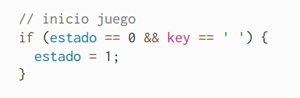
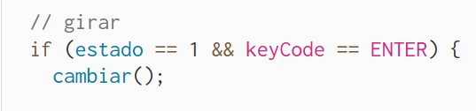
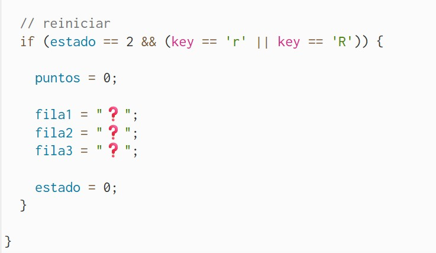
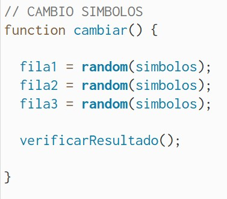
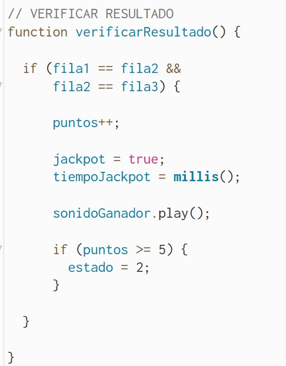
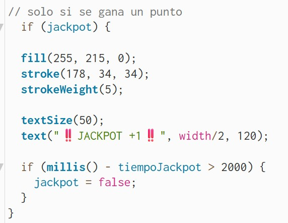
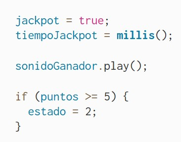

# Examen Final/Pensamiento Computacional/Sección 3

## Tragamonedas Interactivo
[link a p5js](https://editor.p5js.org/elena.fonseca/sketches/hiqb6PPrx)

Autor: Elena Candelaria Fonseca Vogel

Asignatura: Pensamiento Computacional

### Descripción general

Eate proyecto final consiste en una simulacion de tragamonedas interactivo desarrollado en p5.js, en donde el usuario al apretar ciertas teclas hace que la máquina cumpla diversas funciones para poder jugar, pasando por tres estados de juego: 

estado 0 = Pantalla de inicio (Invitacion a jugar)

estado 1 = Pantalla de juego (Máquina tragamonedas)

estado 2 = Pantalla de victoria (Mensaje ganador e invitación a volver a jugar)

### Inputs
Barra espaciadora: Da inicio al juego

ENTER: Cumple la funcion de girar aleatoriamente los simbolos

R: Reinicio del juego al ganar

### Outputs

#### Cambio de símbolos: 🍒, 💎, ⭐, ❤️, 🔔

#### Sonido

Implementación de sonido ganador:

#### Puntaje: Hasta 5 puntos

Al presionar la tecla ENTER, el sistema genera tres símbolos aleatorios utilizando la función random(). Luego compara los resultados obtenidos y verifica si los tres símbolos coinciden. Cuando esto ocurre, se suma un punto al puntaje, se reproduce un sonido de recompensa y aparece temporalmente el mensaje "JACKPOT +1". Finalmente, el sistema comprueba si el jugador ha alcanzado cinco puntos; y si es el caso, cambia automáticamente al estado final de victoria.

#### Mensaje JACKPOT+sonido: Al ganar un punto

Para indicar visualmente cuándo el jugador obtiene un punto, implementé la variable booleana llamada "jackpot". Esto actua cuando los tres símbolos de la tragamonedas coinciden y se activa la función "verificarResultado()" cambiando el valor de esta variable a "true", sumando un punto al puntaje total y reproduce un sonido de victoria.

Posteriormente, durante la ejecución de "pantallaJuego()", se evalúa la condición "if (jackpot)". Si es verdadera, el sistema muestra el mensaje "JACKPOT +1" en pantalla utilizando distintos atributos gráficos como color, contorno y tamaño de texto.

Además, hice uso de la función "millis()" para registrar el momento exacto en que ocurre la victoria. Comparando el tiempo actual con el tiempo almacenado en "tiempoJackpot", el mensaje permanece visible durante 2000 milisegundos (2 segundos). Una vez transcurrido ese tiempo, la variable "jackpot" vuelve a "false", ocultando automáticamente el mensaje.

*Para este comando hice uso de ChatGPT:

### Uso de Console

"console.log()" es una función de salida orientada al desarrollador. Se utiliza para mostrar información del programa en la consola con fines de monitoreo y depuración, permitiendo verificar que los eventos, variables y procesos están funcionando correctamente. En el caso del Traga Monedas, este marca la cantidad de veces que se presiona ENTER en la ronda de juego hasta ganar los 5 puntos.

### Color

Despues de crear mi Diagrama de Flujo, consulté a ChatGPT por los codigos de color del diagrama para que el sistema del Traga Monedas y este tuvieran mas relación entre ellos.

### Reflexión final y Decisiones

#### Principales decisiones tomadas

Una de las principales decisiones del proyecto fue organizar el sistema en tres estados diferenciados: pantalla de inicio (estado 0), juego (estado 1) y pantalla final (estado 2). Esta estructura permitió que la interacción evolucionara de manera clara y ordenada. Además, se incorporó un sistema multimedia mediante sonido y mensajes visuales temporales para reforzar la experiencia del usuario cuando obtiene una combinación ganadora.

#### Dificultades encontradas

La principal dificultad fue gestionar correctamente los cambios entre estados para que cada pantalla tuviera una lógica y función específica dentro del sistema. También resultó desafiante integrar el sonido de recompensa y sincronizarlo con la aparición del mensaje de JACKPOT. Para ello fue necesario comprender el uso de la función "millis()", que permitió controlar el tiempo de visualización del mensaje sin interrumpir el funcionamiento general del programa.

#### Aprendizajes obtenidos

A través de este proyecto pude comprender mejor cómo construir sistemas interactivos utilizando variables, condicionales, funciones y eventos. También aprendí a trabajar con estados para organizar la lógica de un programa más complejo, a utilizar recursos multimedia como imágenes y sonidos dentro de p5.js, y a emplear funciones como "random()", variables boolean "true/false" y "millis()" para generar comportamientos dinámicos y temporales en la interacción.
