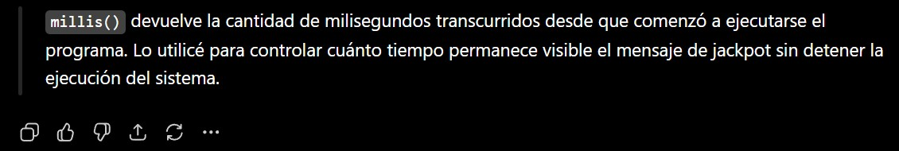

# Examen Final/Pensamiento Computacional/Sección 1

## Tragamonedas Interactivo
[link a p5js](https://editor.p5js.org/elena.fonseca/sketches/hiqb6PPrx)

Autor: Elena Candelaria Fonseca Vogel

Asignatura: Pensamiento Computacional

### Descripción general

Eate proyecto final consiste en una simulacion de tragamonedas interactivo desarrollado en p5.js, en donde el usuario al apretar ciertas teclas hace que la máquina cumpla diversas funciones para poder jugar, pasando por tres estados de juego: 

estado 0 = Pantalla de inicio (Invitacion a jugar)

estado 1 = Pantalla de juego (Máquina tragamonedas)

estado 2 = Pantalla de victoria (Mensaje ganador e invitación a volver a jugar)

### Inputs
Barra espaciadora: Da inicio al juego

ENTER: Cumple la funcion de girar aleatoriamente los simbolos

R: Reinicio del juego al ganar

### Outputs

#### Cambio de símbolos: 🍒, 💎, ⭐, ❤️, 🔔

#### Puntaje: Hasta 5 puntos

Presionar ENTER -> Se generan tres símbolos aleatorios -> El programa compara los símbolos -> ¿Son iguales? -> Sí = suma punto + Activa sonido + Muestra JACKPOT -> ¿Tiene 5 puntos? -> Sí = cambia al estado final

#### Mensaje JACKPOT+sonido: Al ganar un punto

Para indicar visualmente cuándo el jugador obtiene un punto, implementé la variable booleana llamada "jackpot". Esto actua cuando los tres símbolos de la tragamonedas coinciden y se activa la función "verificarResultado()" cambiando el valor de esta variable a "true", sumando un punto al puntaje total y reproduce un sonido de victoria.

Posteriormente, durante la ejecución de "pantallaJuego()", se evalúa la condición "if (jackpot)". Si es verdadera, el sistema muestra el mensaje "JACKPOT +1" en pantalla utilizando distintos atributos gráficos como color, contorno y tamaño de texto.

Además, hice uso de la función "millis()" para registrar el momento exacto en que ocurre la victoria. Comparando el tiempo actual con el tiempo almacenado en "tiempoJackpot", el mensaje permanece visible durante 2000 milisegundos (2 segundos). Una vez transcurrido ese tiempo, la variable "jackpot" vuelve a "false", ocultando automáticamente el mensaje.

Este mecanismo permite generar una respuesta visual temporal que informa claramente al usuario cuando obtiene una combinación ganadora.

